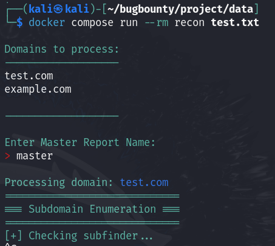
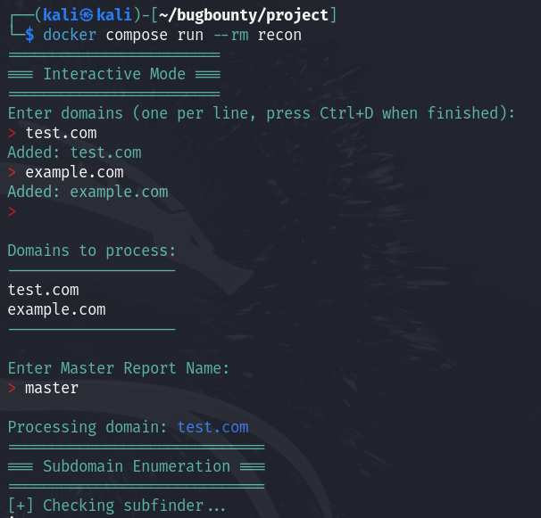
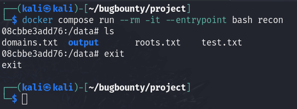

# Install & Build
```
https://github.com/Trapnatized/XXXXXX.git
cd XXXXXX
docker compose build
```
# Running scans with domain-list.txt
Create a domain-list.txt & put inside data folder
The file structure should look like this
```
├── data
│   └── roots.txt
├── docker-compose.yml
├── Dockerfile
├── README.md
└── recon.sh
```
Then run calling the domain-list.txt
`docker compose run --rm recon roots.txt`


# Interactive Mode ( manual doman enteries )
`docker compose run --rm recon`


# Debugging
`docker compose run --rm -it --entrypoint bash recon`

