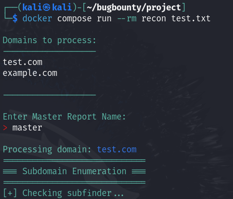

# Install & Build
```
https://github.com/Trapnatized/Recon_Scan.git
cd Recon_scan
docker compose build
```

# Interactive Mode (Manual)
`docker compose run --rm recon`


# Scanning with domain-list.txt
Create a domain-list.txt & put inside data folder or edit roots.txt.

The file structure should look like this
```
├── data
│   └── roots.txt
├── docker-compose.yml
├── Dockerfile
├── README.md
└── recon.sh
```

Then call the domain-list.txt

`docker compose run --rm recon roots.txt`



# Debugging
`docker compose run --rm -it --entrypoint bash recon`


